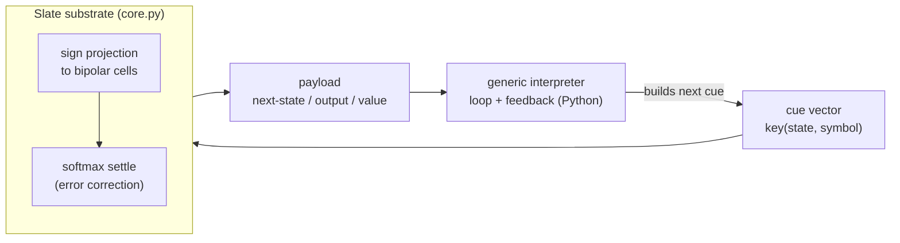

# slate-lab — does the cube think, not just remember?

> **Patent pending.** The substrate, its composition, in-substrate procedure
> execution, and the LLM knowledge/capability distillation methods shown here
> are the subject of U.S. provisional applications **64/109,622** (filed
> 2026-07-11) and **64/112,694** (filed 2026-07-15). Sole inventor:
> Matthew Lancaster · contact via the Scriblio GitHub org (github.com/Scriblio)
>
> **Start here (no API key needed):** `python procedure.py` — watch 4 memorised
> rules beat 400 memorised answers (100% vs 32% on unseen inputs), then an
> 8-rule lesson do exact arithmetic. Then `python transplant.py` (needs an
> `ANTHROPIC_API_KEY`) — watch a frontier model teach the memory a skill it
> keeps forever, for about three cents.

A standalone lab cube built to test, empirically, whether Slate — the one-shot
attractor memory — can be made to **compose, act, learn value, and run stored procedures** when
given depth, feedback, in-substrate value, and a router.

**Guardrail:** every file here is self-contained and re-implements the Slate
primitive from scratch (`core.py`). Nothing here reads, writes, or imports
the live production substrate. This is a lab cube; the production substrate is not this lab's to touch.

## What this is, in standard terms

Branded language is fine, but a skeptic needs the conventional name beside it.
Precisely, this project is:

> a random-projection associative memory (a modern-Hopfield / SimHash store)
> that holds model-authored **finite-state programs** as content-addressable
> transition tables, and executes them with a **fixed, task-agnostic
> interpreter** - so a procedure a frontier model writes once can be run
> cheaply and repeatedly, and tolerates noisy cues that break an exact table.

| this repo's word | conventional term |
|---|---|
| Slate substrate | random-projection associative memory (modern Hopfield / SimHash) |
| feedback / recall-as-set-point | recurrent application of retrieved transition rules |
| in-substrate value | mutable scalar metadata updated by temporal-difference learning |
| depth / bands | stacked / ensembled random projections |
| router | learned operator-selection policy (per-task RL) |
| skill transplant | a model-generated finite-state program, compiled into the store |
| "reason" / "think" | execute a stored procedure via memory + a generic controller |

**What we claim** (now measured against baselines, over many seeds):
1. One task-agnostic interpreter executes a family of ~50 finite-state programs
   from stored tables - the task logic lives in memory, not the interpreter
   (`bench_program_family.py`) - and a frontier model, not the author, compiles
   all 48 into provably-correct DFAs (`bench_synthesis.py`, 48/48 exact vs gold).
2. A procedure stored as **compact transition rules** generalises to unseen
   inputs where the same procedure stored as **example answers** (flashcards)
   does not (`procedure.py`).
3. The associative store gives **error-tolerant execution**: it recovers the
   right rule from a noisy cue where an exact lookup table collapses
   (`bench_vs_baselines.py`).

4. Put together as an **agent skill compiler** on a real workflow — a model
   compiles a prose policy into a program, a verifier checks it on every one of
   7,776 possible inputs, and 100,000 decisions then run with no model in the
   loop while unfamiliar records escalate — the escalation gate catches **100%**
   of records carrying values the program never saw, with **0** silent wrong
   answers and **0%** false alarms. Getting there required finding that the
   shipped `accepted` flag did *not* work. See **[SKILL_COMPILER.md](SKILL_COMPILER.md)**
   for the full measurement, including where Slate loses.

**What we do NOT claim:**
- Not that the shipped abstain flag was ever a working escalation gate. It
  accepted 100% of near-OOD cues and answered 100% of OOD *requests*
  (`bench_escalation.py`); familiarity rises along an out-of-distribution
  trajectory (0.30 -> 0.59) because each step settles into a stored basin.
- Not that escalation needs a fitted threshold at all for the common case. A
  cue built from a symbol that was never committed is out of distribution as a
  FACT (`Slate.vocab` / `Slate.knows()`) - exact, no calibration, no held-out
  sample, 100% of in-dist answered and 0% of every OOD population. At 100k
  decisions it caught 15,000 of 15,000 escalations while the calibrated margin
  threshold caught none. The margin earns its keep only on novel COMBINATIONS
  of known symbols (rule-level margin AUC 0.9995-1.000 vs familiarity 0.62-0.66).
- Not that Slate beats deterministic code, a rules engine, or a memoised dict at
  executing a policy over clean structured input - it is ~1,400x slower than all
  three and ties them on accuracy, and the dict matches its OOD detection too.
- Not that the "cut model calls 85%" figure is a property of Slate. It tracks
  `1 - unfamiliar share` exactly across a 25x sweep: it is a property of the
  workload.
- Not that skill selection is safe. Mis-routing (right library, wrong skill) is
  undetectable by the substrate - AUC 0.50 - because those cues are perfectly
  familiar. That is a router problem and it is unsolved here.
- Not that "memory thinks." The generalisation is done by a fixed interpreter
  *plus* the stored table - a content-addressable transition table inside a
  conventional controller, closer to microcode than to emergent reasoning.
- Not arbitrary skills. The transplant / program results are **finite-state
  (regular) procedures** - divisibility, residues, parity, popcount-mod-k.
  Divisibility is especially friendly to finite automata; success there does
  not show that any model skill compiles to a table.
- Not that Slate beats a vector index on accuracy. Under noise it *ties* a
  kNN / vector store; its differentiators are one-shot write, a unified value
  channel, and (in the production engine) bit-packed compactness - not accuracy.
- Not that the **attractor settle** provides the robustness. An ablation
  (`bench_ablation.py`) shows settle-on and settle-off are identical to
  sigma=2.5 (within +/-1%), and raw kNN edges both at extreme noise: the
  tolerance is the random projection + binary representation, not the recurrent
  dynamics. The settle's hypothesised regime (confusable stored patterns) is
  untested.
- Not that the **knowledge-distillation** result is a property of Slate. A plain
  dict scores the same 100/100/100% at 1/2/3 hops (`deflate.py`, audit 4), and it
  could not be otherwise: `build_bank` commits `entity_vec(src)` and `cube_chain`
  recalls `entity_vec(cur)`, so every cue is byte-identical to its stored key and
  the settle has nothing to correct. Nor can the tolerance fire in principle here
  - `entity_vec` is a blake2b hash, so `cosine(name, name+typo) = +0.010` and a
  misspelled entity recovers 5% of the time. The gap that closes is closed by
  **chaining** the lookup, which is a three-line Python loop, not by the store.
  That is still a real result about retrieval strategy - naive single-shot RAG is
  what struggles on multi-hop - but it is not a result about the substrate.
- The router learns **per task**, not zero-shot; goal-conditioning is future work.

## Does it beat the simplest alternative?

The right question is not "does Slate work" but "what does it do better than a
dict?" We store the *same* div-7 transition table three ways and execute it,
clean and under noisy state-reads, over 30 seeds (`bench_vs_baselines.py`):

| store | clean | noisy cue (sigma up to 1.5) | bytes/rule (lab) | write |
|---|---|---|---|---|
| dict (exact table / DFA) | 100% | **-> 0%** (any perturbation misses) | 512 | 0.004 ms |
| kNN (vector index) | 100% | ~100% | 512 | 0.008 ms |
| **Slate** | 100% | **98-100%** | 8192* | 0.21 ms |

\* the *lab* substrate stores unpacked float32 cells; the production engine
bit-packs 32x (-> 256 B/rule) - a PROJECTED figure, not implemented or measured
here. This counts the stored bipolar pattern only, excluding the shared random
projection matrix, payloads, and Python object overhead; report total resident
memory as rule count grows (a to-do).

Across **48 finite-state program instances** (two generator schemas - residue/divisibility and popcount-mod-k, not 48 independent families) run by one shared DFA interpreter
(`bench_program_family.py`), 5 seeds:

| interpreter store | clean (48 progs) | noisy (sigma=0.75) | capacity |
|---|---|---|---|
| dict | 100% | 0% | - |
| **Slate** | 100% | **100%** | all 957 rules of all 48 programs in one Slate -> 100% clean, no cross-talk |

**Read-out:** on clean cues Slate ties a dict (a dict is simpler - no advantage
there). Its specific, isolable contribution is **error-tolerant procedural
execution** - matching a vector index, and beating a brittle exact table when
the cue is imperfect - shown across a program family, not one cherry-picked case.

## Does the attractor settle earn its keep? (`bench_ablation.py`)

The honest follow-up to the baselines. The same div-7 table executed three ways
over 30 seeds - raw-vector kNN, sign-projected nearest pattern with the settle
**off** (`max_cycles=0`), and full Slate with the settle **on** - identical
rules, queries, seeds, and noise:

| method | sigma=1.0 | 1.5 | 2.0 | 2.5 |
|---|---|---|---|---|
| kNN (raw vector) | 100% | 99% | 90% | 76% |
| Slate, settle OFF | 100% | 97% | 86% | 70% |
| Slate, settle ON | 100% | 97% | 86% | 71% |

**Settle-on minus settle-off is within +/-1% at every noise level** - the
recurrent attractor dynamics add nothing here, and raw kNN is in fact slightly
better at extreme noise (binarisation costs a little). So the error tolerance is
the random projection + distributed binary code, *not* the settle. This is the
ablation the earlier version lacked; it points the interesting question at the
representation, and leaves the settle's hypothesised win (confusable stored
patterns) as the honest next test.

## Anatomy - what lives in the substrate vs in Python

| demo | stored in Slate | external machinery (Python) | baseline | seeds | result |
|---|---|---|---|---|---|
| addition (`procedure.py`) | 8 full-adder rules | bit loop + carry register | flashcards n/a (unbounded output) | 1 (deterministic) | 100% exact on unseen |
| div-7 (`transplant.py`) | 21-rule remainder DFA | MSB bit loop | flashcards 48% / haiku 57% | 1 (det.) | 100% |
| program family (`bench_program_family.py`) | 48 tables, 957 rules | ONE shared DFA interpreter | identical dict-backed interpreter | 5 | Slate 100% clean+noisy; dict 0% noisy |
| store baseline (`bench_vs_baselines.py`) | div-7 table | the interpreter | dict, kNN | 30 | ties clean; beats dict under noise; ~= kNN |
| model synthesis (`bench_synthesis.py`) | 48 model-authored DFAs | the shared DFA interpreter | true gold (all 4096) + dict | 3 | opus 48/48 exact; Slate runs them 100% clean+noisy, dict 0% noisy; ~$1 |

Deterministic demos have variance 0 by construction (a DFA is exact); the seeds
matter for the stochastic store / noise comparisons.

## Architecture



The substrate does content-addressable, error-correcting **retrieval**; the
generic interpreter supplies the **control loop** (which cue to build next, when
to stop). Feedback here is **discrete payload feedback with vector re-encoding**:
each step reads a discrete payload, updates the symbolic state, and builds a
fresh clean cue that noise is then applied to - not a continuous analog state
circulating in the substrate. Reproduce the no-API results table with one
command: `python make_results.py`.

## The primitive (`core.py`)
`Slate` = sign-projection onto bipolar cells + softmax-attention settle.
`key -> payload`, one-shot `commit`, `recall` settles a noisy/unseen key into
the nearest stored basin (error-correction) and reads the bound payload. The
`value` field is the in-substrate value channel TD writes to.

## The experiments

| script | what it tests | what was measured |
|------|-------|--------|
| `run.py` C1 | feedback turns memory into action | reproduced a demonstrated route once, chained it, then rolled it forward from the world-model alone (no environment). 1 handcrafted 6-state world, single run |
| `run.py` C2 | value lives *in* the substrate | PASS — both branches seeded 0; TD climbed good→+1.0, bad→−0.5, propagated to V(START)=+0.9 |
| `run.py` C3 | width (redundancy) helps generalisation | measured (modest): depth-8 96% vs flat 89% only once inputs are corrupted enough to confuse |
| `depth_test.py` | stacked *different* transforms compose | measured: solves K-relation queries iff depth ≥ K; flat single layer = 0%; reversed order = 0% (ordered composition) |
| `noise_ceiling.py` | is "50 deep" real? | YES if the alphabet stays separated. Accuracy ≈ (per-hop)^depth, so the ceiling is set by **alphabet crowding**, not depth. dim-48 → 50 deep free; crowd it → cliff |
| `router.py` | RL over which relation to fire | learns, per task, to pick `SIBLING→LIVES` over the 1-hop `LIVES` trap from reward alone. Per-task, no goal-conditioning; measured against the task optimum, not against A*/tabular-Q |
| `pet.py` | assemble the parts into a maze-learner | a maze-learner built only from substrate + in-substrate value + routing: 200 steps (blind) -> 11 steps (optimal) over training. 1 maze, single run |
| `distill.py` | distil a LARGE model's knowledge into the cube so a SMALL model performs like it | the KNOWLEDGE gap collapses (LARGE−SMALL +89% → **+0%** with cube); the CAPABILITY gap does NOT transfer — it persists for non-smooth functions (parity +54% → +85%, *below chance*: memorising misleads) and only closes for locally-smooth ones (majority interpolates). Memory absorbs the smooth part of reasoning; the non-smooth part stays LARGE's job |
| `distill_llm.py` (**layer B**) | the same experiment with REAL models — SMALL=`claude-haiku-4-5`, LARGE=`claude-opus-4-8` | thesis reproduced on real questions. KNOWLEDGE (opus authors an obscure composer-lineage KB → distilled to 3 cube banks): haiku bare 17/33/8% at 1/2/3 hops → **cube 100/100/100%** = matches opus; gap −85% → **+0%** — but a plain dict also scores 100/100/100 here (`deflate.py` audit 4): the cue is byte-identical to the stored key, so this measures CHAINED RETRIEVAL, not the substrate. CAPABILITY (opus labels, cube memorises, *balanced-acc* on unseen, chance=50%): PRIMALITY (non-smooth) cube seen 98% → **unseen 50% (chance)**; THRESHOLD (smooth) seen 100% → **unseen 82%**. Balanced-acc also exposed haiku's real primality skill = 48%≈chance (its 87% raw was pure base-rate) vs opus 96% — a genuine capability gap the cube provably cannot hand over. Whole run < $1 |
| `procedure.py` | teach the cube the METHOD, not the answers (Matthew's question, 2026-07-15) | **the distill wall falls.** Parity — the function flashcards fail at (400 memorised answers → 32% on unseen, ≈chance) — hits **100% on unseen inputs from a 4-rule lesson** ((state,bit)→state, looped over bits via the C1 feedback machinery). And an **8-rule full-adder lesson gives 100% exact ADDITION** on 400 never-seen pairs (e.g. 2779+2534=5313). The capability rides in compact rules run by a generic loop (loop control in Python, task rules in the substrate) — when distilled as composable steps + feedback, not examples. The distill.py boundary was about the lesson's FORMAT, not the substrate |
| `transplant.py` | the first AUTOMATIC skill transplant — opus authors the recipe, no human writes a rule | opus emits a skill as a step-table (DFA over bits), every rule — transitions AND outputs — poured into substrate, feedback loop executes it, verified vs TRUE gold on balanced unseen sets. **div-3: flashcards 35% / haiku 92% / cube 100%. div-7: flashcards 48% / haiku 57% (can't do it) / cube 100%.** 2 opus calls + 80 haiku calls ≈ **$0.03**. Layer B (facts) + procedure.py (methods) fused: automatic distillation of both substances of knowledge. the large model writes the lesson once; the substrate reuses the compiled procedure with no further model calls |

| `bench_vs_baselines.py` | Slate vs dict vs kNN, 30 seeds | clean all 100%; under noisy cues dict -> 0%, kNN ~100%, Slate 98-100% |
| `bench_program_family.py` | one interpreter, 48 finite-state programs, 5 seeds | Slate 100% clean+noisy vs identical dict-backed interpreter 0% noisy; 957 rules coexist in one store |
| `bench_synthesis.py` (needs API key) | a frontier model compiles the 48 specs, not CC | claude-opus-4-8 authored **48/48 provably-correct DFAs** (exact vs gold on all 4096 inputs), ~$1; Slate runs the model's own tables 100% clean+noisy vs dict 0% noisy |
| `bench_ablation.py` | does the SETTLE add anything? (settle-on vs settle-off vs kNN) | end-to-end acc identical with the settle on/off to sigma=2.5 (+/-1%); raw kNN slightly better at extreme noise -> the robustness is the projection + binary rep, not the attractor dynamics |
| `bench_escalation.py` | **is the abstain flag a safe escalation gate?** (asked FIRST, before building on it) | **no.** The shipped familiarity flag accepts 100% of every near-OOD population and answers 100% of OOD *requests*; near-OOD AUC 0.62-0.66 reproduces slate-bench's text-domain prior (0.611/0.656) in a completely different representation. Cause measured: familiarity RISES along an OOD trajectory (0.30 -> 0.59) as each step settles into a stored basin. Fix measured: min-margin over the trajectory, threshold calibrated on held-out in-dist traffic -> in-dist 98.8-100% answered, unfamiliar 0-2.7%, 99.84% accuracy on answered at 15.9% escalation. Hard limit: mis-routing is invisible (AUC 0.50) |
| `preflight.py` | a real workflow that is EXHAUSTIVELY verifiable | publishing preflight: 8 fields, 7,776 enumerable records, 9 verdicts, priority-ordered. Minimal automaton 52 states / 142 rules; Slate executes it 100% clean and 100% at sigma=0.75; in-dist min-margin 0.400 vs unseen-enum 0.021 |
| `bench_compiler.py` (needs API key) | the whole compiler, end to end, multi-model | authoring reliability: opus **4/5**, haiku **1/5**, llama3.2:1b **0/5** — and opus's one failure was **98.61%** exhaustively correct (wrong on 108/7,776), which no sampled test would catch. At 100k decisions w/ 15% unfamiliar: 85,000 calls avoided, **100%** of unfamiliar escalated, **0** silent wrong answers, 100.00% accuracy on answered, 1.45 ms median vs 1,101 ms all-model, $4.91 vs $32.70. Call reduction = `1 - unfamiliar share` across a 25x sweep — a property of the workload |
| `bench_rivals.py` | vs the simplest COMPETENT alternatives, not a dict | Slate loses on speed: code 1.2 us and dict 1.0 us vs Slate 1,742 us, all at 100%; the dict also matches its OOD detection. Slate's measured edges: 0 labels (vs 1,000-7,776), 166 rules vs 7,776 entries, amendment = 4 one-shot writes changing **0/7,776** old decisions vs a retrain changing **11**, and OOD caught at matched cost **100% vs the trained classifier's 16.5%**. A small local LM (llama3.2:1b) scores 25% — below the 33% majority baseline |

## Interpretation — hypotheses, NOT established by the tests above

The table above is measurements. What follows is what they might *mean* — read
it as direction and speculation, not as results:

1. **Substrate** — a one-shot, content-addressed, error-correcting store.
2. **Feedback** — recall-as-set-point, fed back, becomes behaviour over time.
3. **Value, in-substrate** — one reserved layer per colour; TD makes it prefer the good; generalises for free. (The Seed/affect lane never needed to be a separate module.)
4. **Depth** — stacking different transforms composes inference a single layer can't; affordable to 50 deep while the alphabet stays separated.
5. **Router** — value-guided selection of *which* transform to fire, toward a goal it was never shown a path to.

## Honest open edges
- The error-correcting **settle bought ~nothing** on the depth ceiling — the failure there is *between*-basin misassignment, which cleanup can't fix. Separation is the depth lever, not the settle. (Settle should help in a different regime: confusable stored patterns probed by a corrupted *clean* symbol — untested.)
- The router learns **per-task**, not zero-shot. One value function handling new goals needs **goal-conditioning** (goal folded into the value key). Next step.
- Everything is small-scale and clean. Real scale + real noise is the next frontier.
- The `run.py` (C1/C2/C3) and `pet.py` results are **single-run on one handcrafted world** — variance there is untested. The multi-seed results are `bench_vs_baselines.py` (30 seeds) and `bench_program_family.py` (5).
- The router has **no planning / tabular-RL baseline** yet; "beats the 1-hop trap" is measured against the task's own optimum, not against A* or Q-learning.
- The `distill_llm.py` / `transplant.py` legs need an `ANTHROPIC_API_KEY`; the finite-state programs are **regular languages** — this does not show that arbitrary model skills compile to tables.

## Run
```
python run.py            # C1 action, C2 value, C3 width
python depth_test.py     # stacked composition
python noise_ceiling.py  # the depth ceiling vs alphabet crowding
python router.py         # value-guided operator selection (per-task RL)
python bench_vs_baselines.py    # Slate vs dict vs kNN (the crux baseline)
python bench_program_family.py  # one interpreter, 48 finite-state programs
python make_results.py          # one command -> RESULTS.md (all no-API results)
pytest -q                       # unit tests for the primitive
python bench_synthesis.py       # a frontier model compiles all 48 (needs ANTHROPIC_API_KEY)
python bench_ablation.py        # does the attractor settle add anything? (ablation)

# the agent skill compiler (SKILL_COMPILER.md)
python bench_escalation.py      # does the abstain flag gate escalation? (no key)
python preflight.py             # the real workflow: schema, gold, verifier (no key)
python bench_compiler.py --smoke        # the whole pipeline, no key
python bench_compiler.py        # every available model authors it, then 100k decisions
python bench_rivals.py --no-llm # vs code / rules engine / dict / kNN / trained model
```
