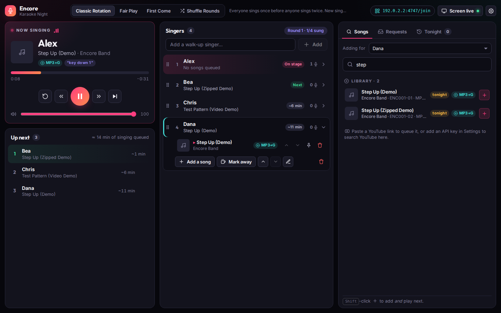
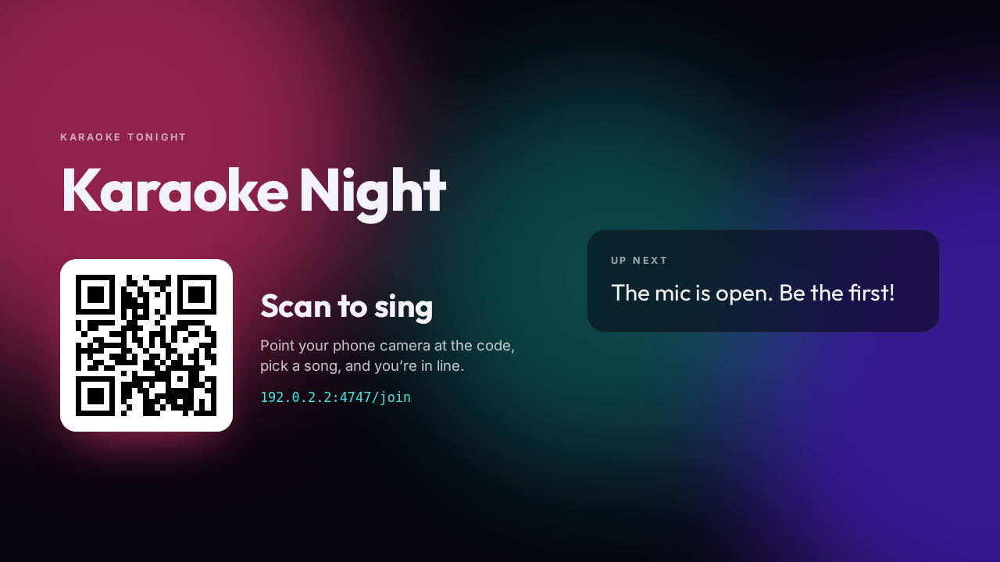
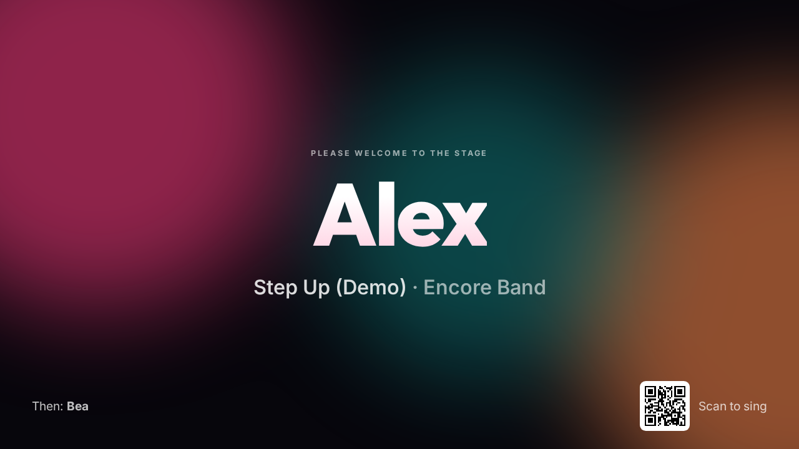
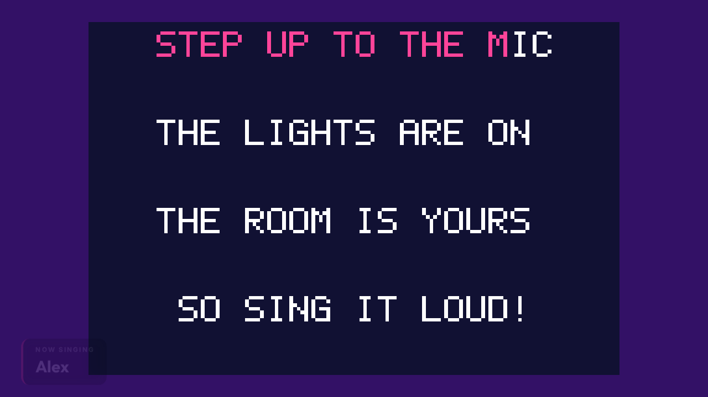
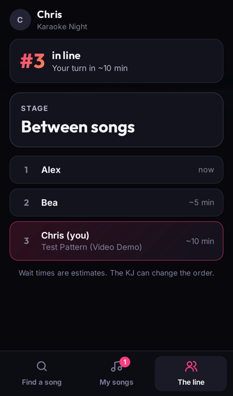

# Encore: karaoke hosting for KJs

Encore runs on the KJ's laptop. It does three things:

- **DJ console** (`/dj`): runs the rotation, the stage and song search.
- **Venue screen** (`/display`): plays the song on the TV or projector, introduces each singer, and shows a QR code between songs.
- **Phone sign-up** (`/join`): singers scan the code, type a name, pick a song and watch their place in line. They don't need an app or an account.

Songs come from your own library (MP4/MKV/WebM video, MP3+G, zipped MP3+G) or from YouTube, so a request the library doesn't have can still be played.



| Between songs | Calling the next singer | MP3+G lyrics | On a phone |
|---|---|---|---|
|  |  |  |  |

## Desktop app (Windows)

Encore also comes as a desktop app. Install it and click the **Encore Karaoke** icon on your desktop: the server starts, and the DJ console opens in its own window. **Open screen** puts the venue screen fullscreen on your second monitor or TV automatically, with no "click to start" step. Demo songs are included until you add your own folders, and **Settings → Browse…** lets you pick those folders.

- **Get the installer:** every push builds one on GitHub (**Actions → Encore desktop → Artifacts**). On a Windows PC you can also run `npm run dist:win` here.
- **Run it from source:** `npm run desktop`.
- **Microsoft Store:** see [STORE.md](STORE.md) for building the Store package and submitting it, plus [PRIVACY.md](PRIVACY.md), a draft privacy policy the Store listing needs.

## Try it in two minutes

You need Node.js 20.12 or newer.

```bash
cd encore
npm install
npm run demo
```

`npm run demo` builds the app, generates a small demo library and starts the server. The demo library has an original song with highlighted CD+G lyrics, the same song zipped, and a test-pattern video if `ffmpeg` is installed. Then:

1. Open **http://localhost:4747/dj** on the laptop.
2. Click **Open screen** and drag that window to the TV. Click it once so the browser allows sound, then press **F** for fullscreen.
3. Scan the QR code with a phone on the same Wi-Fi, join, and pick "Step Up".
4. On the console, press **Call up** (or Space). When the singer is at the mic, press **Start song**.

## Running a real night

```bash
npm install
npm run build
npm start
```

Open **Settings** (the gear icon) to:

- **Add your library folders.** Encore scans them for video files, `.mp3` + `.cdg` pairs and zipped MP3+G, and reads names like `SC8125-01 - Artist - Title`. If your files are named title-first, switch the filename order.
- Set the show name, sign-up limits, request approval, auto-advance and auto-start.

Settings and the current show are saved in `encore/data/`. If the laptop restarts mid-show, Encore picks up where it left off, with the song that was playing paused.

Configuration can also come from the environment: `PORT`, `ENCORE_LIBRARY` (folders separated by `:` on macOS/Linux or `;` on Windows), `DJ_PIN`, `PUBLIC_URL` and `ENCORE_DATA`. For development, `YOUTUBE_API_KEY` makes this copy search YouTube directly with your own key instead of through Encore's search service, and `ENCORE_YOUTUBE_SEARCH=0` turns search off.

### YouTube search

Searching YouTube is built in; KJs don't need a key. YouTube's developer policies allow one API project per app and forbid sharing its key, so every copy of Encore asks Encore's search service (`supabase/functions/youtube-search`), which holds the one key. It answers most searches from a catalog of the top 5,000 karaoke videos (Sing King and KaraFun, built through the API and rebuilt monthly), caches results for everyone, and caps daily use so the shared quota lasts. Pasting a YouTube link never uses the quota. See [supabase/README.md](supabase/README.md) to set it up.

### YouTube videos that won't play here

Some videos YouTube lists as embeddable still refuse to play inside other apps (an uploader's or label's choice). Encore works around that without extra steps for the KJ:

- **The player loads from Encore's site.** YouTube's player runs inside a small page at `sing.scriblio.co/yt-frame` (`src/ytframe/`), so YouTube sees a real website as the embedder rather than the laptop's local address, as YouTube asks of embedders. If that page can't load, or a video only plays the other way, Encore embeds the player directly instead.
- **Queued songs are checked ahead of time.** The console's *YouTube check* card loads each upcoming YouTube song, without playing it, in a small preview player.
- **Refused videos are swapped.** Encore swaps the request for another version of the same song that plays (matching titles so a different song is never substituted) and tells the singer on their phone. That also happens if a video is refused on stage. If no other version turns up, the console and the phone say so.
- **Refusals are remembered** for 30 days on that laptop (`data/youtube-refused.json`, video ids only), and hidden from YouTube search.
- **And shared with every KJ.** Refusals and **Not karaoke** marks go to Encore's search service. Once enough different KJs report a video (2 for "won't play", 3 for "not karaoke"), it's hidden from everyone's searches, and queued requests for it are swapped. If a video later plays after all, it comes back.

## Rotation modes

Switch modes at any time from the top bar.

| Mode | How the next singer is picked |
|---|---|
| **Classic Rotation** | Everyone sings once before anyone sings twice, in list order. New singers join the bottom and still get a turn this round. Drag singers to reorder. |
| **Fair Play** | Whoever has sung the fewest songs tonight goes next; ties go to whoever has waited longest. Newcomers get on quickly on a busy night. |
| **First Come** | Songs play in the order they were requested, whoever asked. |
| **Shuffle Rounds** | Still one song each per round, but the order is reshuffled every round. |

These work in every mode:

- **Play next** (the pin icon) jumps a song to the front of the line.
- **Away** skips a singer without losing their place. Singers can mark themselves away from their phone.
- **No-show** handles a called singer who isn't there. They keep their turn, are marked away, and the next singer is called. When they come back they still sing this round.
- Each singer can have several songs waiting. Their top song is the one they sing next, and they can reorder their own list. In First Come mode, reordering only changes which song fills each of their slots.

The **Up next** panel shows the running order with estimated wait times, and phones show each singer their own position and wait.

## Key change

Library songs (video, MP3+G, audio) can be moved up or down by up to 6 semitones without changing their speed, so CD+G lyrics stay in time.

- **Singers** pick a key when they add a song on their phone: *Key − Original +*.
- **The KJ** changes it on the stage card while the singer is being called up or mid-song: *− Key −2 +*. Click the key itself to go back to the original. Requests show their key in the rotation and in the approval list.
- **Encore remembers each singer's key for each song** from night to night, keyed by their name (`data/keys.json`, forgotten after a year unused). A regular's request comes up in their key, and their phone says what key they used last time.
- **Keys by name ("can you play it in G?").** The console works out each queued library song's original key from its audio, in the background, and remembers it per track (`data/song-keys.json`).
  - The stage card then reads *≈C → G*. Clicking it opens a *Play it in* grid of all 12 keys.
  - The detection is right about four times in five; misses are usually the relative minor. "≈" means it's only detected: **That's right** confirms it, or the KJ picks the right key once and Encore remembers.
  - Phones show the song's key and the key they'll sing in ("−5 · G").
- **YouTube songs keep their original key.** They play in YouTube's own player, which Encore never processes or analyses.

The pitch shifter is a phase vocoder with peak phase locking (`src/shared/pitch.ts`), running in an AudioWorklet on the venue screen. Songs in their original key never go through it. It adds about 32 ms of delay, which the CD+G lyrics account for.

## Night-of controls

| Key | Action |
|---|---|
| Space | Call up the next singer, start the song, or play/pause |
| ← / → | Back / forward 10 seconds |

Click the progress bar to seek. The venue screen shows "Now singing" for the first few seconds of each song and "Up next" in the last 30.

## How phones join

There are two ways in, and Encore picks one automatically:

- **Secure online link (default when the laptop is online).** The QR code opens `https://sing.scriblio.co/#…`. Because it's a normal secure (https) page, phones don't show a "not secure" warning. Singers can join on any network, including cellular data, so venue Wi-Fi that blocks devices from each other doesn't matter. The phone and the laptop talk through Supabase Realtime, and every message is end-to-end encrypted. The key travels only inside the QR code (in the part of the link after `#`, which browsers never send to a server), so the relay carries scrambled data it can't read.
- **Wi-Fi link (fallback).** With no internet, or with the online link turned off in Settings, the QR code points straight at the laptop (`http://192.168.x.x:4747/join`). Phones then need to be on the same Wi-Fi, and some browsers warn that the page isn't secure; tapping *Continue* is safe on your own network.

The online link's room and key are saved in the data folder, so a printed QR code keeps working from night to night.

### Lock-screen alerts

With the online link, singers can turn on **Alerts when my phone is locked** under *My songs*. Their phone then gets a notification when they're next and again when they're called up, even with the page closed or the phone in a pocket. Notifications collapse into one, so "you're up next" becomes "it's your turn".

- **The laptop sends the alerts itself** through the phone browser's own push service (Web Push). It signs them with a key made on that laptop (`data/push.json`) and encrypts them end to end, so there's no shared secret, and the push services see only ciphertext.
- **They work on Android and desktop browsers** right away. iPhones (iOS 16.4 or newer) allow them only from a home-screen web app, so the page explains how: *Share → Add to Home Screen*, then get back in with the rejoin code.
- **The Wi-Fi link can't offer alerts.** Browsers allow push only on secure (https) pages.
- **Subscriptions last for tonight only.** They're forgotten when the singer leaves or a new show starts.

To host the online join page yourself, set `supabaseUrl` and `supabaseKey` in `src/shared/cloud.ts` (a Supabase project's URL and publishable key). Then run `npm run build:sing` and deploy `dist-sing/` to any static host (it includes a `vercel.json`). Point `joinOrigin` at that address.

## Other devices

Phones only ever reach the sign-up page. To run the console or a venue screen from another device, such as a smart TV browser, open `/dj` or `/display` there and enter the **DJ PIN**. The PIN is printed at startup and shown in Settings.

On the Wi-Fi link, if phones can't connect, the venue Wi-Fi is probably isolating clients from each other, which is common on guest networks. Use the online link, run your own hotspot or router, or put Encore behind a tunnel and set `PUBLIC_URL`. Tunnel traffic is recognized by its forwarding headers and treated as a phone, not the KJ.

## Honest limitations

- **YouTube** needs internet. Some uploaders block their videos from playing outside YouTube; search only returns embeddable videos, and Encore swaps any that still refuse (see above). YouTube may show ads in embedded videos. YouTube's terms and your local performance licensing (ASCAP, BMI, SOCAN, PRS and so on) apply to public playback. Check what your venue is covered for.
- **Key change works for library songs only.** YouTube songs play inside YouTube's own player, which Encore can't (and mustn't) process. The pitch shifter sounds clean for a few semitones; toward ±6 its artifacts become audible, as with any real-time shifter.
- **Wait times are estimates.** Local files don't report their length until they've played once, so a default length is used until then.
- **Encore doesn't store or download YouTube media.** It embeds YouTube's player.

## Development

```bash
npm run dev        # server + Vite with live reload on http://localhost:4747
npm test           # rotation engine, CD+G decoder, parsers, server end-to-end
npm run typecheck
```

How the code is organized:

- `src/shared/rotation.ts` is the rotation engine. It is pure functions over the show state, and the same code previews the upcoming order and the wait times.
- `src/server/show.ts` validates and applies every action and saves the show. `src/server/app.ts` is the HTTP and Socket.IO layer, and each client gets a view of the state shaped for its role. Phones never see other singers' private details.
- `src/client/cdg/decoder.ts` is a CD+G decoder written from scratch, so MP3+G lyrics render on a canvas in sync with the audio.
- `src/server/zip.ts` reads zipped MP3+G tracks with no dependencies.
- `src/shared/relay.ts`, `src/server/relay.ts` and `src/client/common/relay-socket.ts` make up the encrypted online join link (P-256 ECDH, HKDF and AES-GCM over Supabase Realtime). On the laptop, each phone becomes an ordinary singer connection, so the online and Wi-Fi links follow the same rules.
- `src/shared/pitch.ts` is the key-change pitch shifter, pure TypeScript so the tests run it in Node. `src/client/display/pitch-worklet.ts` runs it on the audio thread, `src/client/display/key-change.ts` routes a song through it, and `src/server/keys.ts` remembers singers' keys.
- `src/server/webpush.ts` and `src/server/push.ts` send the lock-screen alerts: VAPID signing and RFC 8291 encryption with Node's own crypto, and the turn tracking that decides who to alert. `src/sw/sw.js` is the join page's service worker that shows them, and `src/client/sing/alerts.ts` subscribes the phone.
- `src/desktop/` is the Electron shell. It runs the same server in-process and adds native windows, the folder picker and menus. `scripts/build-desktop.mjs` bundles it, `electron-builder.yml` packages it, and `npm run icons` redraws the icons in `build/`.

## Ideas for next

- Background music between singers
- Singer history across nights (regulars, favorites, "sing it again")
- Printable QR table tents
- Duet requests and tip/priority bumps
